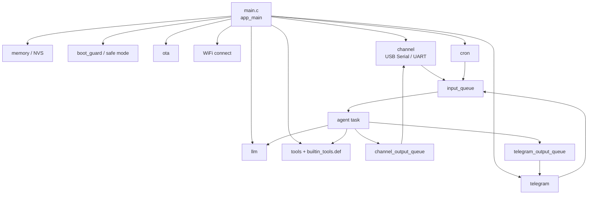
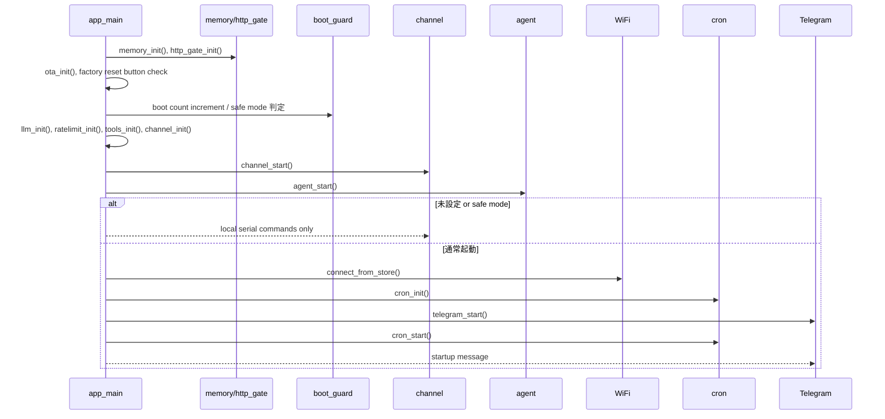
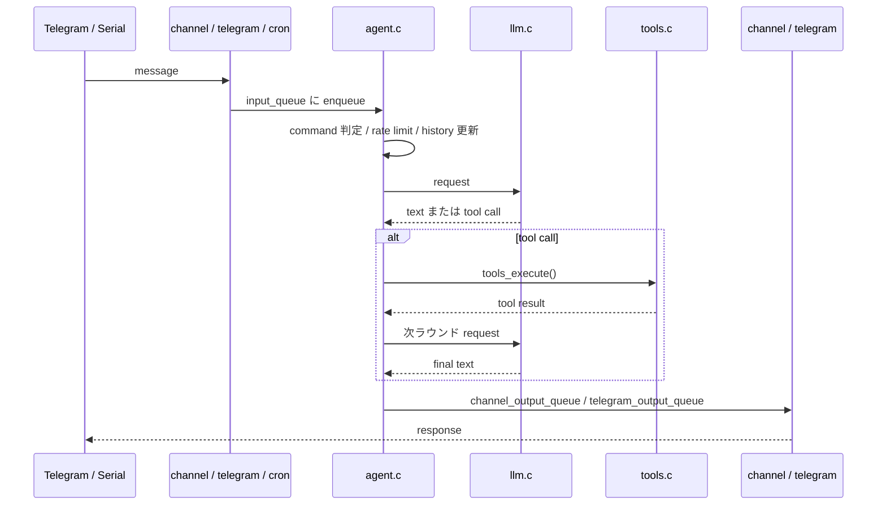
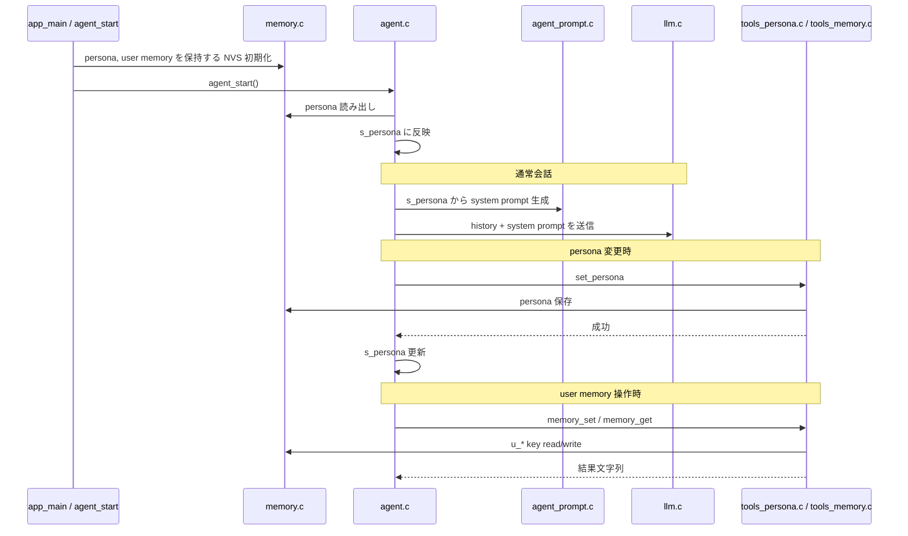
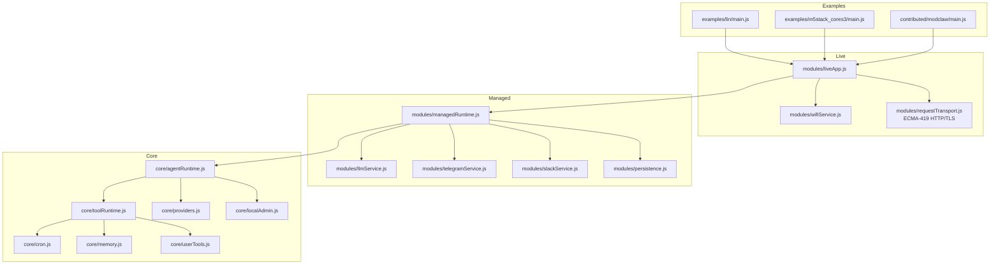
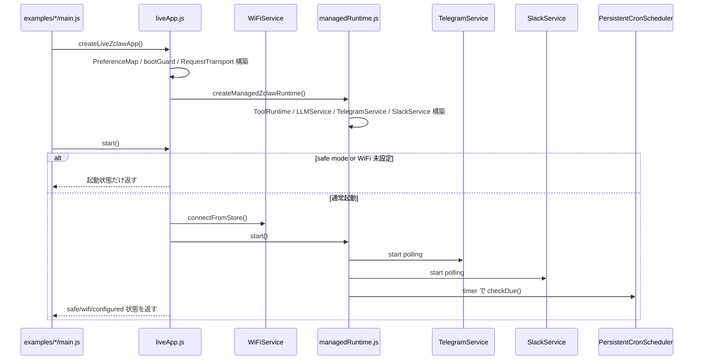
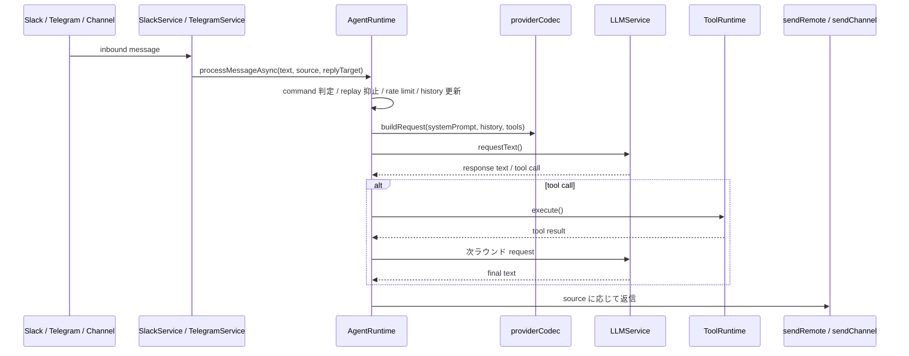
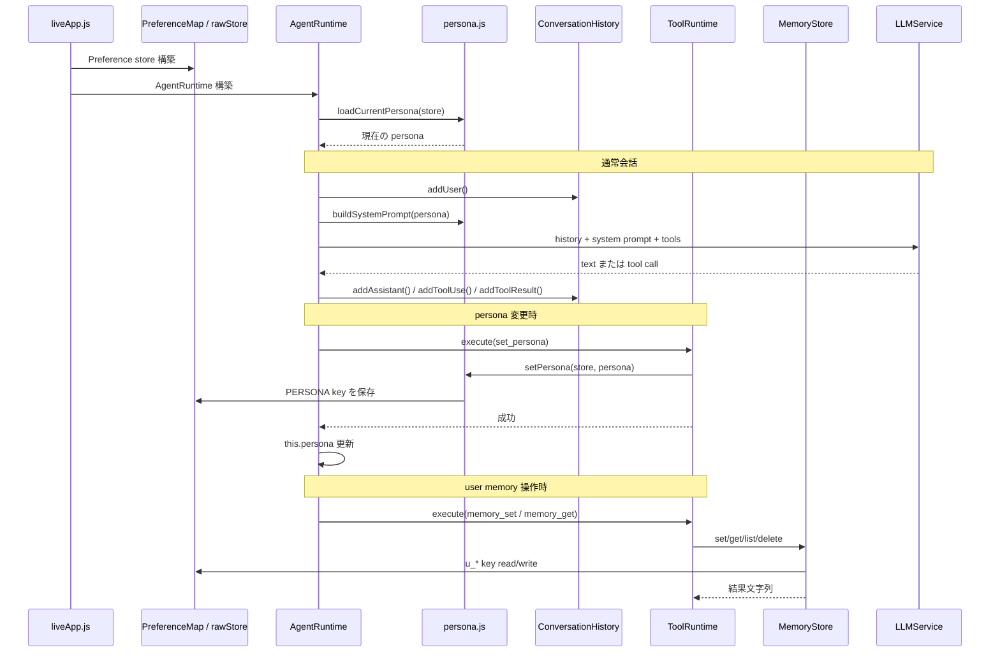

# modclaw / zclaw 実装解説

この文書は、移植元 `zclaw` と、その Moddable 版ポートである `modclaw` の構造を日本語で整理したメモです。

- 移植元 `zclaw` の説明は、repo 直下の [`reference/zclaw`](../../reference/zclaw/) を基準にしています。
- `modclaw` の説明は、このディレクトリ配下の [`core`](./core/), [`modules`](./modules/), [`examples`](./examples/) を基準にしています。
- この repo には独立した `contributed/zclaw` は存在せず、`modclaw` 側の [`modules/zclaw`](./modules/zclaw/) は「移植時に参照した JS 化断片」です。現行の主実装は `core/*` と `modules/*` です。

## 1. 移植元 zclaw

### 1.1 zclaw とは何か

`zclaw` は、ESP32 上で動く C 製の AI エージェント firmware です。自然言語から LLM を呼び出し、GPIO、永続メモリ、cron スケジュール、ユーザー定義ツールを扱います。通信面では Telegram と USB serial console を持ち、host 側の web relay は serial 越しに接続されます。概要は [`reference/zclaw/README.md`](../../reference/zclaw/README.md) にあります。

zclaw の実体は、`main/` 配下の FreeRTOS task / queue ベースの構成です。中核は次のファイルです。

- 起動と全体 wiring: [`reference/zclaw/main/main.c`](../../reference/zclaw/main/main.c)
- 会話ループ: [`reference/zclaw/main/agent.c`](../../reference/zclaw/main/agent.c)
- USB/UART channel: [`reference/zclaw/main/channel.c`](../../reference/zclaw/main/channel.c)
- Telegram polling / send: [`reference/zclaw/main/telegram.c`](../../reference/zclaw/main/telegram.c)
- LLM 呼び出し: [`reference/zclaw/main/llm.c`](../../reference/zclaw/main/llm.c)
- tool registry: [`reference/zclaw/main/tools.c`](../../reference/zclaw/main/tools.c), [`reference/zclaw/main/builtin_tools.def`](../../reference/zclaw/main/builtin_tools.def)
- scheduler: [`reference/zclaw/main/cron.c`](../../reference/zclaw/main/cron.c)
- local admin: [`reference/zclaw/main/local_admin.c`](../../reference/zclaw/main/local_admin.c)

### 1.2 zclaw のアーキテクチャ

設計の要点は次です。

- 入口が複数あっても、最終的には `input_queue` に正規化して `agent` task へ渡します。
- `agent` は会話履歴、tool 実行、LLM request/retry、Telegram 返信を一箇所でまとめて扱います。
- 起動シーケンスでは `safe mode` と `provisioning` の判定を先に済ませ、Wi-Fi に入る前でも local admin command が使えるようにしています。
- web relay は firmware の別 transport ではなく、host 側 relay が serial channel に橋をかける設計です。

### 1.3 zclaw の起動シーケンス

`app_main()` は概ね次の順で進みます。

`reference/zclaw/main/main.c` で見ると、`channel_start()` と `agent_start()` を Wi-Fi より前に起動しているのが重要です。これにより safe mode や未設定時でも `/wifi`, `/bootcount`, `/factory-reset` が使えます。

### 1.4 zclaw のメッセージ処理シーケンス

この設計は、FreeRTOS queue と静的 buffer を使って RAM を厳しく管理する、という `zclaw` の制約に強く依存しています。

### 1.5 zclaw における「人格」と「記憶」

`zclaw` では、「人格」と「記憶」は 1 つの仕組みではなく、役割ごとに分かれています。

- 人格
  - 永続保存: [`reference/zclaw/main/tools_persona.c`](../../reference/zclaw/main/tools_persona.c)
  - prompt 反映: [`reference/zclaw/main/agent_prompt.c`](../../reference/zclaw/main/agent_prompt.c)
  - runtime 保持: [`reference/zclaw/main/agent.c`](../../reference/zclaw/main/agent.c)
- 短期記憶
  - 会話履歴: [`reference/zclaw/main/agent.c`](../../reference/zclaw/main/agent.c) の `s_history`
- 永続記憶
  - NVS read/write: [`reference/zclaw/main/memory.c`](../../reference/zclaw/main/memory.c)
  - user memory tool: [`reference/zclaw/main/builtin_tools.def`](../../reference/zclaw/main/builtin_tools.def)

考え方としては次の 3 層です。

- 人格  
  `persona` は tone を決める永続設定です。`set_persona` / `get_persona` / `reset_persona` で NVS に保存され、agent 起動時に読み戻されます。
- 短期記憶  
  直近の会話文脈は `s_history` に保持され、LLM request を作るたびに投入されます。
- 永続記憶  
  `u_*` key の user memory は NVS に保存され、再起動後も残ります。人格とは別キーです。

zclaw での人格・記憶シーケンスは次です。

## 2. modclaw

### 2.1 modclaw とは何か

`modclaw` は `zclaw` の機能を Moddable/XS 上へ移植した実装です。C の task/queue 構成をそのまま持ち込むのではなく、次の 3 層に分けています。

- `core/*`: platform 非依存の純 JS ロジック
- `modules/*`: Moddable 向けの service / persistence / transport adapter
- `examples/*`: 実行環境ごとの app shell (`lin`, `m5stack_cores3`)

入口は [`createLiveZclawApp`](./modules/liveApp.js)、managed 層の合成点は [`createManagedZclawRuntime`](./modules/managedRuntime.js)、会話ループ本体は [`AgentRuntime`](./core/agentRuntime.js) です。

### 2.2 modclaw のアーキテクチャ

`zclaw` との大きな違いは次です。

- task/queue ではなく、`Promise` と timer を使う async service 構成に置き換えています。
- `AgentRuntime` を純 JS に切り出しており、`xst` でかなり広い範囲を unit test できます。
- transport は共通の [`RequestTransport`](./modules/requestTransport.js) から ECMA-419 HTTP/TLS stack を叩く形です。
- 永続化は NVS 専用 API ではなく `Preference` 互換 map に抽象化しています。

### 2.3 modclaw の起動シーケンス

`modclaw` では `safe mode` と `deviceConfigured` を `liveApp` がまとめて判定し、`managedRuntime` 自体は「すでに動ける状態になったあと」の orchestration に集中させています。

### 2.4 modclaw のメッセージ処理シーケンス

Slack/Telegram/channel は最終的に `processMessageAsync()` へ正規化されます。

`zclaw` の queue 連携は、`replyTarget` を持つ transport-aware な返信モデルに置き換えています。これにより Telegram と Slack が同居しても、受信元へ正しく返せます。

### 2.5 modclaw における「人格」と「記憶」

`modclaw` でも、「人格」と「記憶」は分離されています。対応箇所は次です。

- 人格
  - 定義と prompt 反映: [`core/persona.js`](./core/persona.js)
  - runtime 反映: [`core/agentRuntime.js`](./core/agentRuntime.js)
  - 永続 key: [`core/nvsKeys.js`](./core/nvsKeys.js)
- 短期記憶
  - 会話履歴: [`core/agentHistory.js`](./core/agentHistory.js)
- 永続記憶
  - user memory API: [`core/memory.js`](./core/memory.js)
  - backing store: [`modules/preferenceMap.js`](./modules/preferenceMap.js), [`modules/liveApp.js`](./modules/liveApp.js)

modclaw の整理も 3 層です。

- 人格  
  `persona` は永続設定で、`Preference` 互換 store に保存されます。`buildSystemPrompt()` で毎回 prompt に折り込まれます。設計上、「人格は wording のみを変え、tool choice や safety を変えてはいけない」と明示しています。
- 短期記憶  
  `ConversationHistory` が user / assistant / tool_use / tool_result を rolling buffer として持ちます。これは LLM に渡す対話コンテキストです。
- 永続記憶  
  `MemoryStore` が `u_*` key を読み書きします。こちらは user facts やメモのための領域で、persona key や token 類とは分離されています。

modclaw での人格・記憶シーケンスは次です。

modclaw で重要なのは、人格と永続記憶が同じ backing store を使っていても、責務は分離されている点です。

- `persona`: assistant の話し方を決める device setting
- `history`: その場の会話文脈
- `u_* memory`: ユーザーが保存させた事実やメモ

この 3 つを分けているので、「会話履歴は揮発」「persona は設定」「memory はユーザーデータ」という整理が崩れません。

## 3. zclaw から移植した機能

現時点で `modclaw` に移植済みと言ってよいものは次です。

- 会話履歴、tool round、LLM retry、rate limit からなる agent loop
  - [`reference/zclaw/main/agent.c`](../../reference/zclaw/main/agent.c)
  - [`core/agentRuntime.js`](./core/agentRuntime.js)
- built-in tool 定義、user tool、persona 管理
  - [`reference/zclaw/main/builtin_tools.def`](../../reference/zclaw/main/builtin_tools.def)
  - [`core/tools.js`](./core/tools.js), [`core/userTools.js`](./core/userTools.js), [`core/persona.js`](./core/persona.js)
- memory (`u_*`) と system key の分離
  - [`reference/zclaw/main/memory.c`](../../reference/zclaw/main/memory.c)
  - [`core/memory.js`](./core/memory.js)
- timezone-aware cron
  - [`reference/zclaw/main/cron.c`](../../reference/zclaw/main/cron.c)
  - [`core/cron.js`](./core/cron.js)
- local admin command の文法と recovery 向け UX
  - [`reference/zclaw/main/local_admin.c`](../../reference/zclaw/main/local_admin.c)
  - [`core/localAdmin.js`](./core/localAdmin.js)
- provider 切替
  - `Anthropic / OpenAI / OpenRouter / Ollama`
  - [`reference/zclaw/main/llm.c`](../../reference/zclaw/main/llm.c)
  - [`core/providers.js`](./core/providers.js), [`modules/llmService.js`](./modules/llmService.js)
- boot guard / safe mode の基本方針
  - [`reference/zclaw/main/boot_guard.c`](../../reference/zclaw/main/boot_guard.c)
  - [`modules/bootGuard.js`](./modules/bootGuard.js), [`modules/liveApp.js`](./modules/liveApp.js)
- Telegram polling / send
  - [`reference/zclaw/main/telegram.c`](../../reference/zclaw/main/telegram.c)
  - [`modules/telegramService.js`](./modules/telegramService.js)

## 4. modclaw で未着手、または部分着手の機能

`zclaw` と比べて、`modclaw` 側でまだ未着手、または runtime API まではあるが board 実装が薄い部分は次です。

- 実 GPIO / I2C driver の board 実装
  - [`core/toolRuntime.js`](./core/toolRuntime.js) は `hardware.gpioWrite`, `hardware.gpioRead`, `hardware.gpioReadAll`, `hardware.i2cScan` を要求します。
  - 未注入だと `"not implemented"` を返すので、現状の sample app は「会話 runtime は動くが、実 pin 制御は未接続」です。
- zclaw の USB serial line discipline / host web relay 相当
  - `zclaw` には [`reference/zclaw/main/channel.c`](../../reference/zclaw/main/channel.c) と host relay script 群があります。
  - `modclaw` は [`processChannelMessage`](./modules/managedRuntime.js) を公開していますが、物理 USB serial から自動で行単位入力を食べる adapter はまだありません。
- OTA / firmware rollback / signed update path
  - `zclaw` には [`reference/zclaw/main/ota.c`](../../reference/zclaw/main/ota.c) があります。
  - `modclaw` には現状 OTA 相当の module や update tool はありません。
- ハードウェア factory reset button
  - `zclaw` は `main.c` で BOOT button 長押しを見ています。
  - `modclaw` は `/factory-reset confirm` コマンド経由の消去はありますが、物理 pin 監視は未移植です。
- zclaw の host script 群
  - `install.sh`, `flash.sh`, `provision.sh`, `web-relay.sh`, `benchmark.sh` 相当は `modclaw` にありません。
  - 代わりに `mcconfig` と sample app で build/run する構成です。

## 5. modclaw 独自に追加した機能

`modclaw` は単なる書き換えではなく、`zclaw` にはない独自構成を持っています。

- 純 JS core + `xst` testability
  - `zclaw` の C 実装ではなく、`core/*` を host 上で直接 test できます。
  - test entry は [`tests/run.js`](./tests/run.js) です。
- `managedRuntime` / `liveApp` の二段構成
  - `zclaw` の `main.c` が一箇所でやっていた wiring を JS の composition root に分解しています。
- Slack DM transport
  - `zclaw` は Telegram と serial/web relay ですが、`modclaw` は [`modules/slackService.js`](./modules/slackService.js) を追加しています。
- transport-aware replyTarget
  - Telegram/Slack/channel を共通の `replyTarget` で扱い、返信先を transport ごとに切り替えます。
- `Preference` ベースの persistence
  - `PersistentCronScheduler` と `PersistentUserToolRegistry` で、Moddable の storage model に合わせています。
- ECMA-419 共通 transport
  - [`modules/requestTransport.js`](./modules/requestTransport.js) は Moddable の ECMA-419 HTTP/TLS stack を使います。
- Linux simulator wrapper
  - [`examples/lin/main.js`](./examples/lin/main.js) が `mc/config` から API key や Slack/Telegram 設定を seed できます。
- Piu dashboard sample
  - [`examples/m5stack_cores3/main.js`](./examples/m5stack_cores3/main.js) は runtime 操作用の簡易 UI を持ちます。

## 6. 読み方の目安

コードを追う順番としては、次が一番分かりやすいです。

1. `zclaw` の大枠を知る  
   [`reference/zclaw/main/main.c`](../../reference/zclaw/main/main.c) → [`reference/zclaw/main/agent.c`](../../reference/zclaw/main/agent.c)
2. `modclaw` の合成点を見る  
   [`modules/liveApp.js`](./modules/liveApp.js) → [`modules/managedRuntime.js`](./modules/managedRuntime.js)
3. 会話ループの本体を見る  
   [`core/agentRuntime.js`](./core/agentRuntime.js)
4. tool / persistence / transport を個別に見る  
   [`core/toolRuntime.js`](./core/toolRuntime.js), [`modules/persistence.js`](./modules/persistence.js), [`modules/requestTransport.js`](./modules/requestTransport.js)

この順で追うと、「C firmware の task/queue 設計が、Moddable では service + async orchestration にどう置き換わったか」が掴みやすいです。
