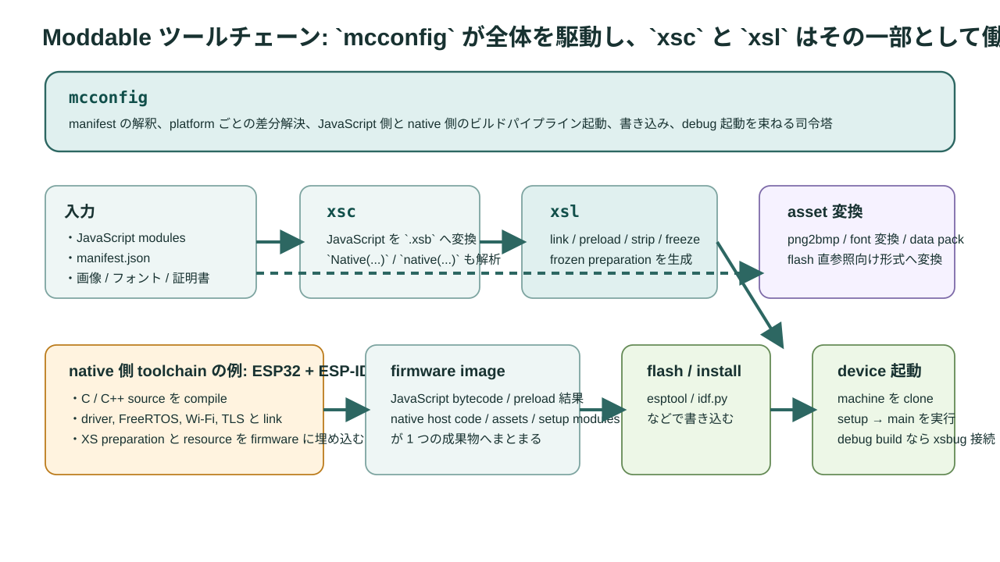

# 第3章 xs と Moddable のツールチェーン全体像

`xs` を単独のエンジンとして眺めていると、開発の全体像を見失いがちです。Web の感覚だと「JavaScript を bundle して終わり」と思いたくなるところですが、組み込みではその先が長いです。manifest を解釈し、JavaScript を `.xsb` へ変換し、preload 済みの machine を準備し、native host とリンクし、最終的には firmware としてデバイスへ書き込みます。最初は遠回りに見えるかもしれません。けれども、ここでの嬉しい点は、その遠回りが起動時間と RAM の節約にそのまま化けることです。

<figure>
  
  <figcaption>図3-1 `mcconfig` が全体を駆動し、その内部で `xsc`、`xsl`、asset 変換、native toolchain、書き込みが動く構図</figcaption>
</figure>

## 3.1 ツールの役割

まずは主要な道具の役割を揃えておきます。

| ツール | 役割 | ひとことで言えば |
| --- | --- | --- |
| `mcconfig` | manifest を解釈し、全ビルド工程を起動 | 司令塔 |
| `xsc` | JavaScript を XS バイトコードへ変換 | AOT コンパイラ |
| `xsl` | `.xsb`、preload、strip、freeze を束ねる | XS 向けリンカ |
| asset 変換群 | 画像、フォント、証明書を target 向け形式へ変換 | data 前処理 |
| native toolchain | host code、driver、RTOS 連携を compile / link | firmware 側 |
| `xsbug` | 実機・simulator の debug と観測 | 観測器 |
| `xst` | XS 単体のシェル | エンジン検証用 |

ここで引っかかりやすいのが `mcconfig` の位置です。`mcconfig -> xsc -> xsl` という一直線の順番ではありません。`mcconfig` が manifest を読み、必要な工程として `xsc` や `xsl` や native 側の build を起動します。つまり `mcconfig` は起点であり、全体をまたぐ存在です。

## 3.2 manifest は設定ファイルではなく設計図

Web エンジニアは `package.json` や `vite.config.ts` に慣れているので、manifest も似たものだと思いがちです。ですが Moddable の manifest は、依存関係だけではなくランタイムの物理設計まで背負っています。

manifest で決める主な項目を並べると、次のようになります。

- どの module を含めるか
- どの data / resource を含めるか
- どれを preload するか
- どの built-ins を strip するか
- どの target / board へ向けるか
- `creation` で machine 予算をどう切るか
- setup module と main module をどう組むか

このため manifest は「ビルド設定」ではなく、「どんな machine を作りたいか」を書く設計図として読む必要があります。

## 3.3 ビルドパイプライン

では、実際には何が起きるのでしょうか。典型的には次の流れです。

1. 開発者が JavaScript modules、manifest、assets、native source を用意する
2. `mcconfig` が manifest を解釈し、platform 別差分を解決する
3. `xsc` が JavaScript を `.xsb` へ変換する
4. `xsl` が `.xsb` を束ね、preload、strip、freeze を行い、frozen preparation を作る
5. asset 変換ツールが PNG やフォントを flash 直参照向け形式へ変換する
6. native toolchain が host code、driver、RTOS 連携コードと一緒に firmware をリンクする
7. firmware をデバイスへ書き込み、debug build なら `xsbug` と接続する

ここで意外に思われるかもしれませんが、JavaScript 側の処理は途中段階にすぎません。最終成果物は `.xsb` ではなく、native host と JavaScript preparation と asset をまとめた firmware です。

## 3.4 ESP32 と ESP-IDF の例

native 側の流れが見えにくい、という経験があるかと思います。そこで ESP32 を例にします。ESP32 では、多くの場合 native 側の toolchain として ESP-IDF が下敷きになります。

実際の感覚は次の通りです。

- `mcconfig -p esp32/<board>` を実行する
- その結果、JavaScript 側では `xsc` と `xsl` が走る
- native 側では ESP-IDF の C/C++ compile と link が走る
- 生成された firmware image を `esptool.py` や `idf.py` 系の仕組みで flash へ書き込む

ここで大切なのは、「JavaScript を firmware へ埋め込む」という感覚です。Node.js のように script file を後から読むのではありません。`xs` の bytecode、preload 結果、native host code、driver、FreeRTOS、network stack が一つの成果物へまとまります。

この構造を知っていると、次のことに納得しやすくなります。

- `setup/network` が単なる helper ではなく、host runtime の一部に見える理由
- release build と debug build で挙動や観測可能性が変わる理由
- `xsbug` 接続や firmware 書き込みが build 体験の一部になる理由

## 3.5 `xst` と simulator の違い

`xst` は simulator の別名ではありません。ここはかなり混同されます。

| 目的 | 向いている手段 | 理由 |
| --- | --- | --- |
| XS 単体の言語挙動確認 | `xst` | 余計な host を外して見られる |
| Moddable アプリ全体の確認 | simulator | setup、resource、host を含めて確認できる |
| RAM / RTOS / flash 帯域 / real I/O の確認 | 実機 | 本当に効く差が出るのはここ |

preload の成功可否、Wi-Fi 接続、pins、FreeRTOS 上の Worker を見たいなら実機や simulator が必要です。逆に、Compartment の API や strip 後の言語挙動を最小構成で見たいなら `xst` が便利です。

## 3.6 setup module と main module

`documentation/base/setup.md` を読むと、setup module は main より先に動き、環境を整える役割だと説明されています。`setup/network` や `setup/piu` が典型です。

この分離がありがたいのは、起動経路を整理しやすいからです。いきなり `main.js` の top-level に全部詰め込むと、何が preload 可能で、何が host 依存で、何が一度だけ必要なのかが見えなくなります。

ただし油断は禁物です。

- setup module の呼び出し順は保証されない
- Worker では setup module が自動で走らない
- setup へ重い native 初期化を詰め込みすぎると、起動経路が太る

## 3.7 典型コマンド

| コマンド | 用途 |
| --- | --- |
| `mcconfig -d -m -p esp32/moddable_two` | ESP32 実機へ debug build |
| `mcconfig -m -p esp32/moddable_two` | ESP32 実機へ release build |
| `mcconfig -d -m -p simulator` | simulator debug build |
| `xst foo.js` | XS 単体で script を確認 |
| `mcrun -d -m` | mod の build / install |

`-d` を外した瞬間に `xsbug` や一部の観測が使えなくなります。最適化確認に入る直前までは、debug build を基本に据える方が迷いが少ないでしょう。

## 3.8 なぜ build を重くするのか

ここまで見てくると、「そこまでして build で前倒しする必要があるのか」と感じるかもしれません。もっともな疑問です。けれども MCU では、build の複雑さを runtime の単純さへ変換できること自体が価値です。

- 実行時に source を読まない
- 実行時に class や prototype を大量生成しない
- 実行時に import 解決を最小化する
- ROM から bytecode と frozen object を直接使う

嘆かわしいことに、Web の感覚のままではこのありがたみが見えにくいです。しかし起動時間、RAM、安定性のどれかで詰まった瞬間に、この前払いの意味が急に見えてきます。

## 3.9 実装読解の入口

この章に対応する入口は次の通りです。

- `tools/mcconfig.js`
- `xs/tools/xsc.c`
- `xs/tools/xsl.c`
- `documentation/tools/manifest.md`
- `documentation/base/setup.md`
- `documentation/xs/preload.md`

`mcconfig` を見ると全体 orchestration が見えます。`xsl.c` を見ると preload、freeze、strip がどこで入るかが見えます。この順で追うと、図3-1 のどこに何が対応しているかが掴みやすくなります。

## 3.10 この章のまとめ

1. `mcconfig` は `xsc` や `xsl` の後ろにいるのではなく、全体を駆動する司令塔
2. `xsc` は JavaScript を `.xsb` へ変換し、`xsl` は preload と strip を含む link を担う
3. native 側では ESP-IDF のような toolchain が host code と firmware を組み立てる
4. 最終成果物は JavaScript bundle ではなく firmware

次章からは、その firmware の中で動く XS machine の内部構造に入ります。
