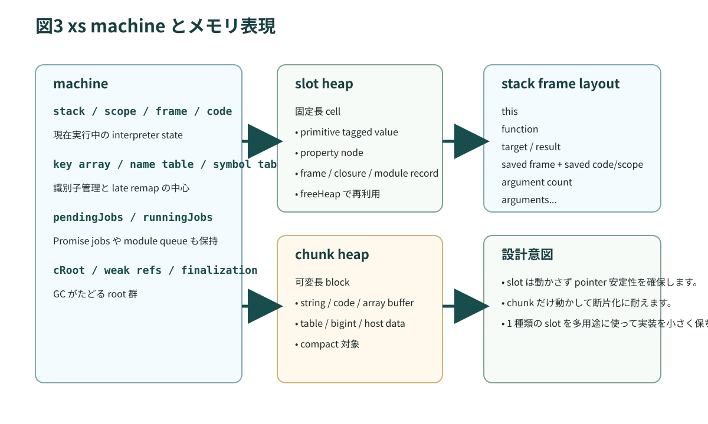
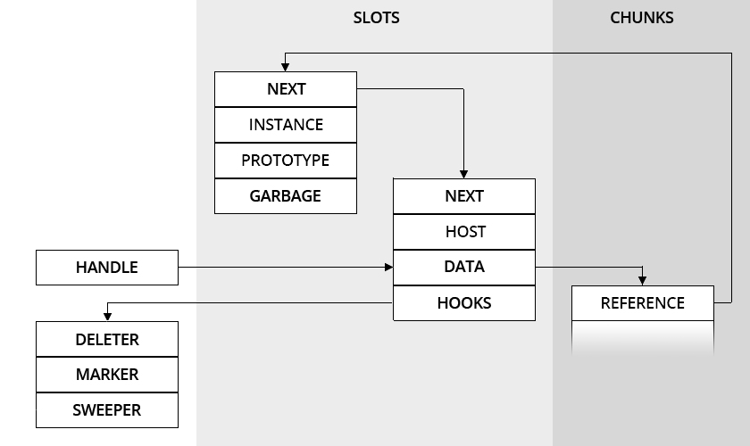

# 第4章 xs のランタイムデータ構造

`xs` を理解する上で最も重要な構造は machine です。machine は仮想マシン本体であり、スタック、スコープ、現在のコード位置、ヒープ、キー表、各種内部状態を抱えています。本章では、一般的な JavaScript エンジンの「スタックとヒープ」という見方を、`xs` の具体的なデータ構造へ落とし込みます。

<figure>
  
  <figcaption>図4-1 XS machine の主要領域。slot heap、chunk heap、stack、keys が分かれて見えることが重要</figcaption>
</figure>

## 4.1 machine という単位

`documentation/xs/XS in C.md` では、machine を XS runtime の主構造と説明しています。そこでは次のような骨格が示されています。

```c
typedef struct xsMachineRecord xsMachine
struct xsMachineRecord {
	xsSlot* stack;
	xsSlot* scope;
	xsSlot* frame;
	xsByte* code;
	xsSlot* stackBottom;
	xsSlot* stackTop;
	xsSlot* stackPrototypes;
	xsJump* firstJump;
};
```

この抜粋だけでも、`xs` がスタックベースの VM であり、現在の scope と frame を明示的に持っていることがわかります。Web エンジンでは、こうした構造を開発者が直接意識しないことも多いですが、`xs` では manifest の `stack` 設定や Worker ごとの memory config を考えるときに、machine 単位の発想が不可欠です。

## 4.2 slot と chunk

`xs` のメモリ理解で外せないのが、slot と chunk の二分です。

| 領域 | 役割 | 特徴 |
| --- | --- | --- |
| slot | 値、参照、property、closure、instance など | 固定サイズ、移動しない |
| chunk | 文字列、bytecode、配列データ、可変長データ | 可変サイズ、GC で移動することがある |

`documentation/xs/handle.md` では、slot は 32-bit MCU で典型的には 16 bytes と説明されています。固定サイズで移動しないため、参照の土台や GC のルート管理に向いています。一方 chunk は可変長なので、文字列やバッファのようにサイズが変わるデータを効率よく保持できます。

これは `xs` 固有の実装選択です。JavaScript エンジン一般には「ヒープにいろいろある」と説明されがちですが、`xs` はヒープをさらに性質の違う二領域に割っています。

## 4.3 なぜ二つに分けるのか

組み込みでは、断片化とメタデータのコストが非常に痛いです。すべてを可変長ブロックにすると、管理情報も断片化対策も重くなります。逆にすべてを固定サイズにすると、文字列やバイトコードで無駄が増えます。

そこで `xs` は、

- 小さい制御単位は slot
- 大きく可変な実データは chunk

と分けています。これにより、GC は slot 側で参照グラフを扱いやすくしつつ、chunk 側では必要に応じてコンパクションできます。MMU を持たない環境では、この設計がかなり効きます。

## 4.4 key table と識別子

`xs` には key array があります。JavaScript の property 名や symbol 名を、内部識別子と結び付けて管理する仕組みです。Web エンジンでも同様の仕組みはありますが、`xs` では manifest の `creation.keys.initial` や `creation.keys.incremental` として予算化されます。

これは実務上とても重要です。動的に property 名を増やすと、単にオブジェクトが増えるだけでなく、key table も増えます。Mods やユーザー拡張を入れると、ホストが持っていなかったキーが一気に流入するので、この予算設計が必要になります。

## 4.5 creation パラメータは VM 予算

`xsCreateMachine` に渡す `xsCreation` や manifest の `creation` セクションでは、次のような値を決めます。

| パラメータ | 意味 |
| --- | --- |
| `static` | slot と chunk を含む総予算の上限 |
| `stack` | JavaScript stack の深さ |
| `heap.initial` / `heap.incremental` | slot heap の初期量と増分 |
| `chunk.initial` / `chunk.incremental` | chunk 領域の初期量と増分 |
| `keys.initial` / `keys.incremental` | runtime keys の予算 |
| `nativeStack` | host 側の C stack |

ここで大事なのは、これらが単なる「性能チューニング」ではないことです。`stack` が不足すれば深い call や複雑な式評価で破綻しますし、`keys.incremental` を 0 にすれば、想定外のキー生成時に machine が abort する可能性があります。つまり、manifest は VM に対する契約でもあります。

## 4.6 handle は host object と GC の橋

`documentation/xs/handle.md` は、`xs` の host object 設計を理解するうえで非常に重要です。

<figure>
  
  <figcaption>図4-2 handle は slot に固定された参照点を持ちながら、chunk 側の移動を許す</figcaption>
</figure>

handle の要点は次のとおりです。

- host object 自体は JavaScript からは普通の object に見えます。
- C 側では host slot の data 部から chunk を参照します。
- slot は移動しないので handle 自体は安定します。
- chunk は GC で移動し得るため、GC が host slot 側の pointer を更新します。

つまり handle は、「GC 管理下の可変データを C から高速に触りたい」という要件に対する `xs` の答えです。これも Web エンジン一般の話ではなく、組み込み寄りの `xs` らしい設計です。

## 4.7 property の見え方

多くの JavaScript エンジンでは object の property アクセス最適化に hidden class や shape などの用語が出てきます。`xs` では、ROM 上にある instance と property の並びを linker が最適化する話が重要になります。後の ROM colors の章で扱いますが、ここでは「property は単なる抽象的な概念ではなく、slot の並びとして存在する」と意識しておけば十分です。

この見え方を持つと、

- freeze すると何が減るのか
- alias がどこに要るのか
- ROM object の property access をなぜ linker で最適化できるのか

が理解しやすくなります。

## 4.8 実装を読むポイント

この章に関係する実装や文書は次の順で読むとわかりやすいです。

1. `documentation/xs/XS in C.md` の Machine Allocation 節
2. `documentation/xs/handle.md`
3. `xs/sources/xsMemory.c`
4. `xs/sources/xsAll.h`

特に `xsMemory.c` では、ROM 上の object を patch する必要があるかどうか、freeze 済みかどうかの判断がメモリコストに直結していることが見えてきます。

## 4.9 この章のまとめ

本章の結論は明快です。

1. `xs` の中心単位は machine です。
2. machine は slot、chunk、stack、keys を分けて持ちます。
3. manifest の creation は、machine 予算そのものです。
4. handle は C と GC を安全かつ高速につなぐための重要な仕組みです。

次章では、この machine がどのようにコードを実行し、stack、scope、bytecode、module を組み合わせていくのかを見ます。
