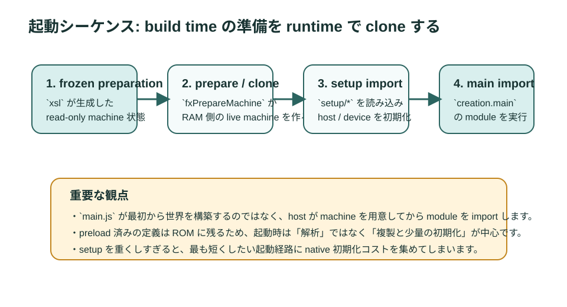

# 第5章 コンパイルと実行モデル

前章では machine の器を見ました。本章では、その器の中で JavaScript がどう実行されるかを追います。特に重要なのは、`xs` が単なる「source を読みながらその場で動くエンジン」ではなく、build 時のコンパイル結果と preload 結果を前提にした VM だという点です。

<figure>
  
  <figcaption>図5-1 compile 時と run 時の境界。<code>xs</code> は compile 側へかなり多くの仕事を押し出す</figcaption>
</figure>

## 5.1 source から bytecode へ

一般的な JavaScript エンジンと同様に、`xs` でも source は解析され、内部表現へ変換されます。`xsc` はこの処理を build 側に持ち出し、JavaScript を `.xsb` に変換します。これによりデバイス側では source parse のコストをほぼ払わずに済みます。

ここで押さえたいのは、「バイトコード化は最適化の一部であり、目的そのものではない」ということです。組み込みで本当に価値があるのは、source を読まないことそのものより、source を読んだ結果できる環境構築まで前倒しできることです。

## 5.2 スタックベース VM と frame

`xs` はスタックベースの VM です。式の評価結果、関数呼び出しの引数、一時値、戻り値は stack 上を行き来します。`XS in C` の machine 定義に `stack`、`scope`、`frame`、`code` が並んでいるのはそのためです。

スタックベース VM では、次の点が実務に効きます。

- 深い call chain は `stack` 予算に効きます。
- 大きな一時配列より、複雑な式ネストや再帰が意外に stack を使うことがあります。
- C callback から見る `xsArg(n)`、`xsThis`、`xsResult` も stack モデルの延長です。

再帰的アルゴリズムや深い Promise 連鎖をそのまま持ち込むと、Web では問題なくても `xs` では manifest の `stack` 見直し対象になることがあります。

## 5.3 スコープと closure はどう持たれるか

`xs` でも lexical scope が採用されており、関数は必要な外側変数だけを closure として持ちます。ここで実務的に重要なのは、preload された module の closure が ROM に置かれうる点です。

たとえば module スコープの `let count = 0` は、preload 後には「ROM にある初期値に対して、変更があれば RAM で差分を持つ」ような形になります。`const` を使えば差分用 pointer が不要になり、RAM を節約できます。これは一般的な JavaScript エンジンの教科書にはあまり出てこない、`xs` らしい最適化ポイントです。

## 5.4 setup module と main module の実行順

`documentation/base/setup.md` では、`setup/` で始まる module は main より先に走ると説明されています。実際のアプリ起動を頭の中で追うと、概ね次のようになります。

1. build 済みの frozen preparation がロードされます。
2. それを基に live machine が準備されます。
3. `setup/*` module が実行されます。
4. `creation.main` で指定された main module が import されます。
5. main の default export が callable なら起動入口として使われます。

この順序を意識すると、どの初期化を setup へ置くべきか、どの module を preload すべきかが整理しやすくなります。

## 5.5 import は単なるファイル読込ではない

ES Modules の import は、`require()` の別名ではありません。解決、依存グラフ、初期化順、namespace、live binding を伴います。`xs` では、通常の module import に加えて、Compartment や Mods による別 module map の話も出てきます。

このとき重要なのは、module 評価には副作用があることです。class 定義、prototype 生成、定数データ構築、closure 生成が起きます。だからこそ preload が効きますし、逆にネイティブ依存処理を module top-level に書くと preload できなくなります。

## 5.6 Promise job はいつ走るのか

Promise の継続は job queue に積まれます。`xs/sources/xsPromise.c` の `fxQueueJob` と `fxRunPromiseJobs` を見ると、この動きがかなり露骨に見えます。

```c
void fxQueueJob(txMachine* the, txInteger count, txSlot* promise)
{
	if (mxPendingJobs.value.reference->next == NULL) {
		fxQueuePromiseJobs(the);
	}
	...
}
```

```c
void fxRunPromiseJobs(txMachine* the)
{
	job = mxRunningJobs.value.reference->next = mxPendingJobs.value.reference->next;
	mxPendingJobs.value.reference->next = C_NULL;
	while (job) {
		...
		mxRunCount(count - 6);
		...
		job = job->next;
	}
}
```

ここで見えるのは、job が pending queue に入り、後でまとめて流されることです。概念としてはブラウザの microtask queue と同じですが、どのタイミングで `fxQueuePromiseJobs` がホストへ接続されるかが `xs` ホスト実装の肝になります。

## 5.7 実行モデルが設計へ及ぼす影響

この実行モデルを知っていると、次の実務判断がしやすくなります。

- top-level で巨大なデータ構築をするなら preload を前提に書く
- ネイティブ依存処理は preload 不可の境界に寄せる
- setup module は「起動時に一度だけ必要なこと」に限定する
- Promise 連鎖や Worker 初期化で、どこが同期でどこが非同期かを明確にする

特に Worker 生成は、`documentation/base/worker.md` にあるように worker module の初期実行が完了してから constructor が戻ります。つまり、Web Worker の感覚で「とりあえず重い初期化を worker 側に逃がす」とすると、生成時点で親 machine をブロックしうる点に注意が必要です。

## 5.8 実装を読む入口

本章に対応する実装の入口は次のとおりです。

- `xs/tools/xsc.c`
- `xs/sources/xsScript.c`
- `xs/sources/xsRun.c`
- `xs/sources/xsModule.c`
- `xs/sources/xsPromise.c`

細部まで追う必要はありません。まずは「parse と run が分かれていること」「module import が専用経路を持つこと」「Promise jobs が queue で回ること」を確認すれば十分です。

## 5.9 この章のまとめ

1. `xs` はスタックベース VM として動きます。
2. module 評価は多くの object 生成を伴うため、preload と相性がよいです。
3. Promise 継続は queue に積まれ、後で流されます。
4. 実行モデルの理解は、manifest、setup、preload、Worker 設計に直接効きます。
