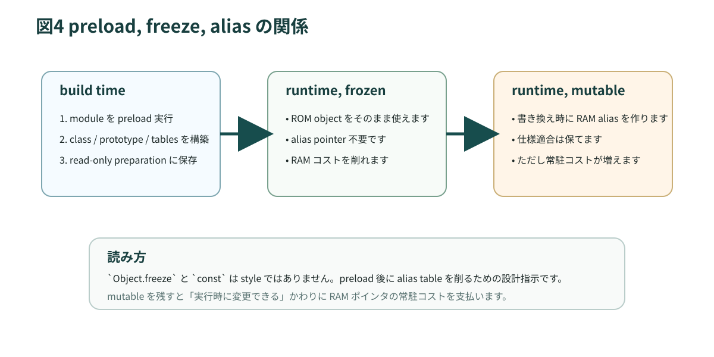

# 第7章 ROM を前提にした設計

`xs` を他の JavaScript エンジンと最も分ける章です。preload、freeze、alias、strip、ROM colors は、どれも「限られた RAM しかないのに JavaScript の豊かなオブジェクト世界をどう成立させるか」という問いへの答えです。

<figure>
  
  <figcaption>図7-1 preload で ROM に置けるものと、runtime 側で alias が必要になるものの関係</figcaption>
</figure>

## 7.1 preload とは何か

`documentation/xs/preload.md` は、preload を「build 時に module の一部を実行して target 起動前に環境を準備する仕組み」と説明しています。ここでのポイントは二つです。

- 起動時に必要な class、prototype、定数 object、module closure を ROM に置けます。
- 起動時に払うはずだった初期化コストを build 時へ移せます。

たとえば、class 定義は source を読んだ瞬間に静的に完成するわけではありません。JavaScript では class も module 実行時に構築されます。つまり preload なしでは、デバイス起動のたびに class と method object を作ることになります。preload はこのコストを消します。

## 7.2 preload で得られる利益

preload の利益は、単に「速い」だけではありません。

| 利益 | 何が起きているか |
| --- | --- |
| 起動が速い | class 定義や import 解決を build 時に済ませる |
| RAM が増える | ROM 上の object をそのまま使える |
| 初期状態が安定する | built-ins や preloaded module が凍結された状態に近づく |
| 複数 machine で共有しやすい | 同じ read-only machine から clone できる |

特に最後の点は Worker や marshalling の章につながります。同じ read-only machine を共有することは、単なる起動高速化以上の意味を持ちます。

## 7.3 preload できないもの

preload は build machine 上で行われるため、target 固有の native 操作は実行できません。`preload.md` では、たとえば `Digital.write()` のような native function 呼び出しは preload 失敗になると説明されています。

つまり preload に向く code と向かない code は、次のように分かれます。

| 向く code | 向かない code |
| --- | --- |
| class 定義 | GPIO 操作 |
| 静的データ構築 | Wi-Fi 接続 |
| pure な helper module | デバイス時刻の取得 |
| import 関係の解決 | 実機依存のドライバ初期化 |

実務では、module を「pure な準備」と「実機依存の起動」に分けると preload しやすくなります。

## 7.4 freeze と deep freeze

`xs` では freeze が非常に重要です。理由は前章で見たとおり、ROM object を変更可能と見なす限り alias 用の RAM が必要だからです。`preload.md` では `Object.freeze(obj, true)` という `xs` 拡張も紹介されています。これは再帰的に freeze するための実用上の支援です。

Web であれば深い freeze はやりすぎに見えることがあります。しかし `xs` では、

- 設計上の不変条件を明示できる
- alias pointer を減らせる
- 実行環境の信頼性を高められる

という三重の意味があります。

## 7.5 自動 freeze と Frozen Realm 的な世界

`preload.md` によると、preload 後に XS linker は built-ins の prototype や preloaded function 群を freeze します。これは Frozen Realm 的な環境を作る発想です。

ここでの利点は二つあります。

1. built-ins が実行中に patch されないことが保証されやすくなります。
2. patch 不可能な object には alias 予算を割かなくて済みます。

つまり secure / reliable / memory efficient の三要素が一致しています。この一致が `xs` の美しいところです。

## 7.6 alias は仕様準拠のための現実解

ROM に object を置く以上、本来は変更不能です。しかし JavaScript は object を変更できる言語です。このギャップを埋めるために `xs` は alias table を使います。ROM object 自体はそのままにして、変更が発生したときだけ RAM 側に差分や clone を持たせます。

これは `xs` 固有の重要な仕組みです。一般的な Web エンジンではあまり意識しません。だからこそ、freeze しない object が RAM コストを伴うことを忘れやすいのです。

## 7.7 strip は ROM 予算の最適化

`documentation/xs/XS Differences.md` でも触れられているとおり、`xs` は未使用の言語機能を strip できます。たとえば `eval` や `Function` を使わないなら、parser や bytecode generator を含む関連コードを ROM から落とせます。

これは組み込みでは極めて合理的です。アプリが自己完結していて、あとから任意の JS source を読み込まないなら、source parser を残す必然はありません。

ただし、strip はアプリ設計と強く結び付きます。

- Mods を使うなら、strip しすぎると追加 module が動けません。
- `xsbug` の EVAL で stripped feature を使うと `"dead strip"` が出ます。
- 開発時と本番時で strip 方針を変えるか、最初から本番想定で動かすかの判断が必要です。

## 7.8 ROM colors

`documentation/xs/ROM Colors.md` は、ROM object の property access を graph coloring で最適化する仕組みを説明しています。発想はこうです。

1. preload 済み object 群に含まれる key の衝突関係を調べます。
2. key に color を割り当てます。
3. property slot を並べ替え、色に基づく index access を可能にします。

これにより、ROM 上の linked list を毎回なめるコストを減らせます。`Math` のような built-in object の property access が速くなるのは、この手の工夫があるからです。

これはまさに `xs` 固有の話です。JavaScript の言語仕様だけ読んでいても出てきません。

## 7.9 preload 向けに module を書くコツ

preload 向けの module には書き方のコツがあります。

1. top-level は pure な初期化に寄せます。
2. 実機依存処理は遅延させます。
3. 共有データは `const` と freeze を基本にします。
4. prototype patch を前提にしません。
5. build machine で意味を持たない I/O を top-level に書きません。

たとえば設定テーブル、色定義、HTTP ヘッダ定義、状態遷移表、UI テンプレートの定数部分は preload と相性がよいです。一方、ソケット接続やピン初期化は setup または main に残すべきです。

## 7.10 実装と資料を読む入口

この章では次のファイルが重要です。

- `documentation/xs/preload.md`
- `documentation/xs/ROM Colors.md`
- `xs/tools/xsl.c`
- `xs/tools/xslStrip.c`

`xslStrip.c` を見ると、どの built-in が strip 対象として扱われるかがわかります。`ROM Colors.md` を読むと、メモリ最適化とアクセス速度最適化が同じ設計の中で扱われていることが見えてきます。

## 7.11 この章のまとめ

1. preload は build 時実行によって起動時間と RAM 使用量を削減します。
2. freeze は設計の明示だけでなく RAM 節約です。
3. alias は JavaScript の可変性と ROM 利用を両立するための現実解です。
4. strip と ROM colors は、組み込み向けに ROM 予算とアクセス性能を最適化する `xs` 固有の武器です。
