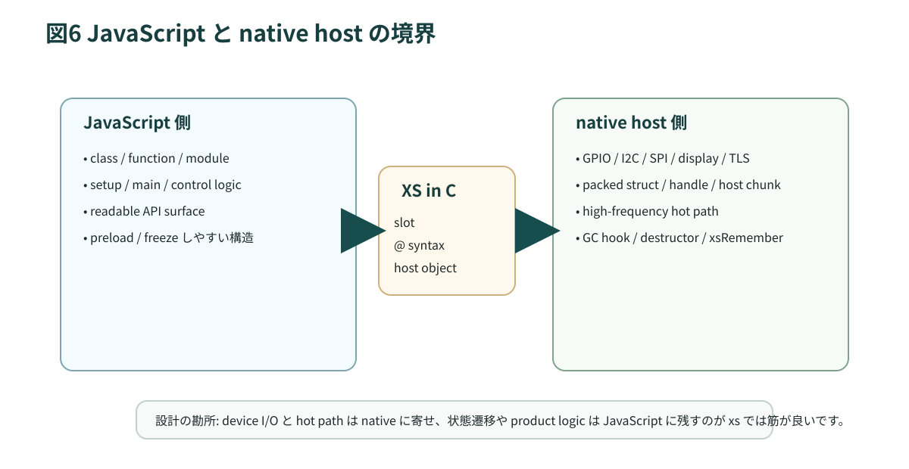

# 第8章 C/ホストとの連携

JavaScript で書けるところまで JavaScript で書きたい、という気持ちは自然です。とはいえ、組み込みではそこに一段ひねりが入ります。JavaScript 側へ無理に抱え込むと、slot が増え、chunk が増え、毎フレームの dispatch が増えます。意外に思われるかもしれませんが、`xs` では C へ降ろすことが「逃げ」ではなく、設計を素直にする場面がかなりあります。



## 8.1 C が要る理由

`xs` は ECMAScript の汎用機能を実装しますが、GPIO、Wi-Fi、画面、音声、RTOS タスク、ドライバは host 側の責務です。`documentation/xs/XS in C.md` は、アプリケーションが C callback を通じて specific features を与える host だと説明しています。

要するに、`xs` は「JavaScript だけで完結する世界」ではありません。必要な能力を host が注入する JavaScript です。

## 8.2 `XS in C` の基本

`XS in C` の基本単位は slot です。C 側では JavaScript の値を生の object として触るのではなく、slot API を通して読み書きします。ここで最初に慣れておきたい感覚は次の通りです。

- primitive は direct slot
- object や function は reference slot
- integer や stringx は観測できない最適化表現

この見え方に切り替わると、「JavaScript の値」と「C から見える値」の境界がかなりはっきりします。

## 8.3 `xs` マクロと `xsmc` マクロ

`XS in C` には二系統のマクロがあります。

| 系統 | 特徴 |
| --- | --- |
| `xs*` | 書きやすい。コードサイズはやや増えやすい |
| `xsmc*` | やや低水準。バイナリは小さくしやすい |

ROM も予算に入るので、host 側コードが膨らみ始めたら `xsmc` 系へ寄せる判断にも意味があります。ここは Web の感覚では見えにくいところでしょう。

## 8.4 `@` 構文より Native API

かつて `xs` の host binding といえば `@` 構文でした。たとえば次のような書き方です。

```js
class Rectangle @ "xs_rectangle_destructor" {
  constructor(...params) @ "xs_rectangle";
  get x() @ "xs_rectangle_get_x";
}
```

ただし `@` は `xs` 独自構文です。標準の JavaScript parser はここで構文エラーになります。エディタ、lint、formatter、型検査、周辺ツールをまたぐと、ここがすぐに痛点になります。

そこで今は、公式の Native API を中心に考える方が実務的です。`documentation/xs/XS in C.md` では、`@` は intentionally incompatible with JavaScript であり、代わりに `Native(...)` と `native(...)` を使う API があると説明されています。

```js
class Rectangle extends Native("xs_rectangle_destructor") {
  constructor(...args) {
    super();
    native("xs_rectangle").call(this, ...args);
  }
  get x() {
    return native("xs_rectangle_get_x").call(this);
  }
  set x(it) {
    native("xs_rectangle_set_x").call(this, it);
  }
  contains(x, y) {
    return native("xs_rectangle_contains").call(this, x, y);
  }
}
```

ここでの便利な点は二つあります。

- 標準的な JavaScript 構文の範囲に収まる
- `xsc` が一定のパターンを認識し、`@` と同じ bytecode へ最適化できる

つまり、可読性と周辺ツールとの相性を取りにいっても、効率面で大きく損をしないわけです。

## 8.5 Native API の読み方

Native API の見方はシンプルです。

- `Native("name")` は host destructor を持つ constructor を返す
- `native("name")` は host callback を表す function を返す

ただし注意点もあります。`xsc` が最適化として認識するのは、文字列リテラル 1 個を渡す形です。ラッパを重ねすぎると、最適化の前提から外れます。

## 8.6 `@` 構文の位置づけ

`@` を完全に知らなくてよいわけではありません。既存コードや古いドキュメントではまだ頻繁に見かけます。ただし本書では、次の位置づけに留めます。

- 既存コード読解では読む必要がある
- 新規実装の第一選択にはしない
- チーム開発や周辺ツールとの相性を考えるなら Native API を優先する

この割り切りを持っておくと、8章の理解がぐっと楽になります。

## 8.7 host object と host data

host object は、C からだけ見える data pointer と native destructor を持つ object です。これが必要になるのは、JavaScript の property 群だけでは扱いにくい状態があるからです。

- ピクセルバッファ
- レイアウト情報
- デバイスハンドル
- 通信セッション
- タイマや queue に紐づく native state

このあたりを全部 JS object で持つと、slot 消費も dispatch も重くなります。

## 8.8 handle と GC

`documentation/xs/handle.md` は、handle を「slot は動かないが chunk は動く」事情に合わせた仕組みとして説明しています。


Piu のような UI ツリーを思い浮かべると分かりやすいでしょう。親子関係を毎フレーム辿るたびに JavaScript property access を重ねるのは重いですし、chunk の移動に生ポインタで追従するのも危険です。handle はその間を埋めます。

## 8.9 GC と lifetime 設計

ここは油断しやすいところです。C 側で JS 値を保持するなら root 管理が必要ですし、host object を作るなら destructor や mark hook も責務に入ります。

- JS から見えない参照を C が持つなら mark が必要
- chunk を直接指すなら移動可能性が前提
- 長寿命の状態には host object / handle が向く
- destructor の責務を曖昧にすると事故になりやすい

Web より見つけにくいバグが出るのは、ここです。GC、RTOS、デバイス状態が絡むため、再現が鈍いことが珍しくありません。

## 8.10 setup module と host 境界

`documentation/base/setup.md` を読むと、setup module は main より先に走り、画面や network などの環境を整えるとあります。ここは host 境界を JavaScript 側へ見せる窓口でもあります。

考え方としては次の三つで十分です。

- ドライバ初期化や platform 固有処理は setup に寄せる
- preload 可能な純粋 module と混ぜない
- setup は薄く保ち、残りは main や service module へ逃がす

## 8.11 native 化の判断

では、いつ C に降ろすべきでしょうか。目安は次の通りです。

- 毎フレームや高頻度ホットパスで property access が支配的
- 数値処理や buffer 処理が多く、slot / chunk 消費も重い
- デバイス API を薄く包むだけでは済まず、状態機械やバッファ管理が必要
- profiler で支配的ボトルネックだと分かっている

逆に、低頻度の制御ロジックまで C に落とすと、嬉しさより保守コストが先に来ます。

## 8.12 実装読解の入口

- `documentation/xs/XS in C.md`
- `documentation/xs/handle.md`
- `documentation/base/setup.md`
- `xs/sources/xsAPI.c` の `fxBeginHost` / `fxEndHost`

Native API の節を先に読み、その後で `fxBeginHost` を見ると、JavaScript と C の境界が思っている以上に薄いことが実感しやすくなります。

## 8.13 この章のまとめ

1. `xs` は host が能力を与える JavaScript エンジン
2. 新規実装では `@` より Native API を中心に据える方が実務的
3. host object と handle は GC、安全性、性能の折衷点
4. native 化は profiler と lifetime 設計が前提
