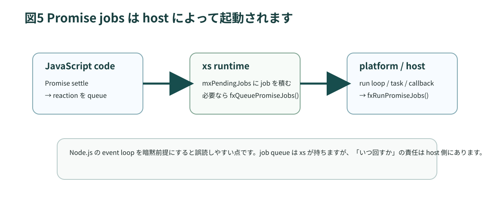
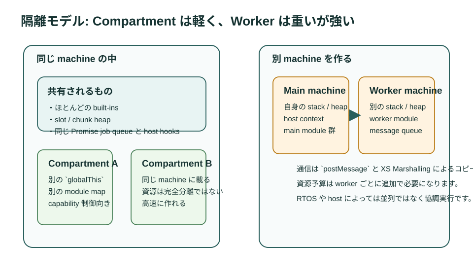

# 第9章 非同期、モジュール、隔離

## 9.1 Promise が動く場所

Promise は言語機能ですが、job queue の実行そのものは host 依存です。`xs/sources/xsPromise.c` の `fxRunPromiseJobs` を見ると、pending jobs を running jobs へ移し、順に `mxRunCount` で処理しています。queue が空から非空になると `fxQueuePromiseJobs(the)` が呼ばれ、host に実行機会を要求します。



この設計から分かることは次の通りです。

- Promise は「見えないスレッド」ではありません
- host が jobs を回さなければ進みません
- machine ごとに job queue の責務を持ちます

Web エンジニアがよく持つ「イベントループが何とかしてくれる」という感覚は、`xs` では host/runtime の責務としてより明示的に見えます。

## 9.2 setup と main の順序

第3章でも触れた通り、setup modules は main より先に動きます。`documentation/base/setup.md` は、setup modules が最初の main virtual machine でのみ走り、Worker では走らないと明記しています。

この事実は重要です。

- main machine の初期化責務は setup に集まります
- Worker を作っても setup 済みの環境が自動で再現されるとは限りません
- network や screen を global に置いている設計は、machine 境界をまたぐと破綻しやすいです

## 9.3 module 境界が preload と security に効く理由

JavaScript module は依存関係管理の単位ですが、`xs` ではさらに二つの意味を持ちます。

1. preload 可能性の単位
2. capability を絞る単位

純粋 module は preload しやすく、Compartment にも渡しやすいです。逆に host 直結 module を無秩序に広く公開すると、mod や compartment から与えたくない能力まで漏れやすくなります。

## 9.4 Compartment が分離するもの

`documentation/xs/XS Compartment.md` は、Compartment が同じ machine の中にある lightweight virtual host だと説明しています。各 compartment は、自分の `globalThis`、global lexical scope、module map を持ちますが、多くの built-ins は共有します。

これは重要な特徴です。

- 別の global namespace を持てます
- import できる module を制限できます
- capability を明示的に注入できます
- しかし memory は完全分離ではありません

つまり Compartment は、軽量な sandbox としては優秀ですが、資源隔離の切り札ではありません。

## 9.5 Mods は製品拡張の仕組み

`documentation/xs/mods.md` は、mods を secure、lightweight、value-adding な仕組みとして説明しています。mods は precompiled bytecode と resource と manifest から成り、mod host が必要な module だけを読み込みます。

mod の観点で大事なのは次の点です。

- すべてを本体 firmware へ焼き込まなくてよいです
- `Compartment` を使って capability を絞れます
- `Resource` により flash 上の data を直接利用できます
- ただし host 側は strip と keys 予算を mod 前提で考える必要があります

mods を採用するなら、host は「どの JavaScript 機能を残すか」「mod が使える module は何か」「runtime keys をどこまで許容するか」を明示しなければなりません。

## 9.6 Worker は「別 machine」

`documentation/base/worker.md` は、Worker を複数 virtual machines の API と説明しています。本書ではここを強調します。Worker は別スレッドのコールバックではなく、別 machine です。



Compartment と Worker を比較すると次のようになります。

| 項目 | Compartment | Worker |
| --- | --- | --- |
| 実体 | 同一 machine 内の隔離 | 別 machine |
| `globalThis` | 別です | 別です |
| heap | 共有します | 別です |
| message | 直接 capability を渡せます | `postMessage` と marshalling が基本です |
| RAM コスト | 比較的小さいです | 追加 machine 分だけ大きいです |
| 用途 | sandbox、capability 制御 | 隔離、応答性確保、並列実行 |

## 9.7 Worker の初期化コスト

Worker の API は Web に似ていますが、`documentation/base/worker.md` には重要な差分があります。`new Worker()` は指定 module の初期実行が終わるまで返らず、初期化中の例外はコンストラクタから再送出されます。

これは実務上かなり重要です。

- Worker の起動 code は短く保つべきです
- 重い preload 不可処理を start-up に詰め込むと、生成側をブロックします
- worker module でも manifest 相当の予算感覚が必要です

## 9.8 Worker のメモリ予算

`documentation/base/worker.md` では、Worker constructor に `static`、`stack`、`heap`、`nativeStack`、`priority`、`core` などを渡せると説明しています。つまり Worker は、別 machine をどんな予算で起動するかをその場で決める API です。

```js
let worker = new Worker("telemetry-worker", {
  static: 8192,
  stack: 64,
  heap: {
    initial: 64,
    incremental: 32
  },
  nativeStack: 8192
});
```

ここから分かるのは、Worker 導入は並列化の前に、RAM 追加コストを明示的に背負う決断だということです。

## 9.9 `postMessage` はコピーが基本

Worker 間通信は `postMessage` ですが、`documentation/base/worker.md` と `documentation/xs/XS Marshalling.md` は、通信が基本的にコピーだと説明しています。`SharedArrayBuffer` などの例外はあるものの、大きな object graph を送れば、それだけでメモリと時間を使います。

したがって、Worker 設計では次を守るべきです。

- メッセージは小さくします
- バイナリは必要最小限にします
- 高頻度通信より、責務分割で負荷を減らします
- queue の詰まりと timeout を監視します

## 9.10 preemptive と cooperative

`documentation/base/worker.md` は、host runtime によって workers が preemptive または cooperative scheduling になると説明しています。ESP32 など FreeRTOS 系は preemptive、ESP8266 は cooperative です。

この違いは、設計判断に大きく影響します。

- cooperative では、隔離はできても、ブロッキングを完全には防げません
- preemptive では、応答性改善や二つの CPU core の活用が狙えます
- ただしどちらでも RAM コストは消えません

Worker を採用する前に、「本当に別 machine が必要か」「Compartment や設計整理では足りないか」を必ず考えてください。

## 9.11 隔離機構の選び方

簡単な判断表を示します。

| 状況 | 向いている選択 |
| --- | --- |
| 同じ machine で capability だけ絞りたい | Compartment |
| 製品拡張として追加 module を安全に走らせたい | Mods + Compartment |
| main の応答性を守りつつ別予算で処理したい | Worker |
| 大量の RAM を食うユーザコードを物理的に分けたい | Worker |
| 起動コストと RAM を最小にしたい | 単一 machine + preload |

## 9.12 この章のまとめ

1. Promise jobs は machine と host の契約の上で回ります
2. setup は main machine だけで走る前提なので、Worker へ自動継承されません
3. Compartment は軽量な sandbox ですが、完全な資源分離ではありません
4. Worker は別 machine であり、追加 RAM と初期化コストを伴います
5. Mods は製品拡張の仕組みですが、host 側が strip、keys、capability の設計責任を負います

次章では、これらの構造を xsbug や profiler でどう観測するかを扱います。
