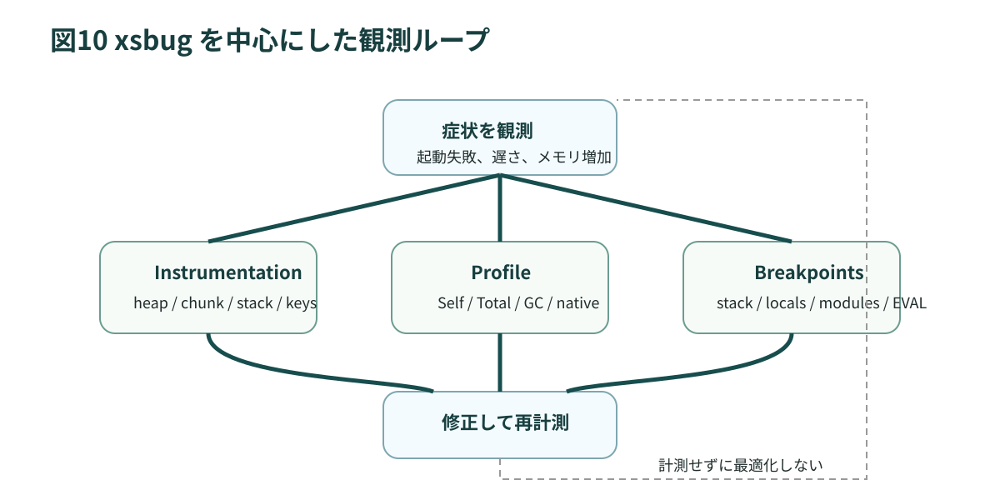

# 第10章 デバッグ、計測、トラブルシュート

## 10.1 xsbug は単なるソースデバッガではありません

`documentation/xs/xsbug.md` は、xsbug を source level debugger と紹介しつつ、real-time instrumentation と profiler を備えると説明しています。本書では、この後者を重視します。`xs` 開発では「どこで止まったか」だけでなく、「どの資源が増えたか」を見る必要があるからです。

## 10.2 まず見るべきパネル

xsbug の主要パネルと、本書の観点での意味を表にします。

| パネル | 何を見るか | 何に効くか |
| --- | --- | --- |
| Calls | 現在のフレームと呼び出し元 | stack や再帰の把握 |
| Locals / Globals | 今どの object graph が見えているか | 可変状態の追跡 |
| Modules | preload 済みか runtime load か | preload 設計の検証 |
| Instrumentation | slot、chunk、keys、stack | 予算超過の切り分け |
| Profile | ホットパスの把握 | native 化や構造改善の判断 |

<figure>
  
  <figcaption>図10-1 まず Instrumentation と Profile に戻る、という切り分け順を固定すると迷いにくい</figcaption>
</figure>

## 10.3 Modules pane の意味

`documentation/xs/preload.md` は、xsbug の module pane が preload 済み module を青、runtime load module を黒で表示すると説明しています。これは `xs` 実務で極めて有用です。

見るべきことは単純です。

- preload したつもりの module が青になっているか
- 実機依存 module が黒のまま残っているか
- 想定外の module が runtime で読み込まれていないか

preload の成否は、ソースを見ただけでは判断しにくいことがあります。module pane はその答え合わせです。

## 10.4 Instrumentation で見るべき数字

第6章で紹介した通り、次の指標を追います。

- Slot Heap Used
- Chunk Heap Used
- Keys Used
- Modules Loaded
- Stack Used

ここで重要なのは、単発の値より変化です。たとえば次のように読みます。

- ある操作後に Slot Heap Used が戻らないなら、object graph が生き残っています
- Chunk Heap Used のピークだけ大きいなら、一時バッファ生成を疑います
- Keys Used が単調増加なら、動的プロパティ名や mod の導入を疑います
- Stack Used が急増するなら、再帰や深い call chain を疑います

## 10.5 profiler を使う順番

`xsbug.md` と `XS Profiler.md` が示す通り、profiler は JavaScript 上のホットスポットを見つける道具です。ここでの原則は単純です。

- 体感だけで native 化しない
- まず profiler で hot path を特定する
- algorithm、allocation、I/O のどれが支配的か分ける

JavaScript が遅いのではなく、毎回大きな object を組み立てているだけ、ということは珍しくありません。その場合、native 化より preload や freeze や構造改善の方が効きます。

## 10.6 典型的なエラーの読み方

よく見る症状を整理します。

| 症状 | まず疑うこと |
| --- | --- |
| `dead strip` | manifest の `strip` とコードの食い違いです |
| preload 失敗 | module body に native call が混ざっていないか見ます |
| Worker 起動失敗 | worker module の初期化例外とメモリ設定を見ます |
| 長時間運転で不安定 | keys と chunk の増加、message queue 詰まりを見ます |
| 実機だけ遅い | simulator で隠れていた I/O、flash、RTOS 要因を疑います |

## 10.7 breakpoint の使い方

通常の source debug ももちろん重要です。Calls と Locals を使って現在の状態を見るだけでなく、Eval フィールドでその場の式を評価できます。ただし、`xsbug.md` は、strip 済み機能を Eval で使うと `"dead strip"` と表示されると説明しています。

つまり Eval は万能 REPL ではありません。今の build の言語環境に従う、ということです。

## 10.8 実機でしか出ない問題

組み込みでは simulator と実機の差が大きいです。主な理由は次の通りです。

- 実機では RAM と flash 帯域が厳しいです
- setup が実デバイスを初期化します
- RTOS の優先度や queue 詰まりが発生します
- USB/Wi-Fi 経由の xsbug 接続やログ出力が timing に影響します

したがって、次の順で見るのが実務的です。

1. simulator で機能確認
2. debug build 実機で xsbug 計測
3. release build 実機で再確認

simulator で問題が無いことは、実機でも安全だという保証にはなりません。

## 10.9 スクリーンショット TODO

今後の版では、次の人手取得スクリーンショットを差し込みます。追跡は <code>99-asset-todo.md</code> に分離しています。  
・最新の xsbug PROFILE タブ 
・実機デプロイから xsbug 接続までのログ 
・ケーススタディの実測メモリグラフ

## 10.10 トラブルシュートの型

問題に当たったときは、次の順で切り分けると効率が良いです。

1. 再現条件を最小化します
2. preload の有無、strip の有無、Worker の有無を一つずつ外します
3. xsbug で slot / chunk / keys / stack のどれが動くかを見ます
4. host 側の queue や native resource 管理を見ます
5. 実装読解が必要なら、関係する関数だけを絞って source を追います

この型を守ると、闇雲な manifest 調整や C 化を避けやすくなります。

## 10.11 この章のまとめ

1. xsbug は debugger であり、同時に observability tool でもあります
2. Modules pane は preload 設計の検証に使います
3. Instrumentation は slot / chunk / keys / stack の切り分けに使います
4. profiler は native 化の前に hot path を特定するために使います
5. simulator と実機の差を前提に、必ず実機で最終判断します

次章では、ここまでの理解を「どう書くべきか」のルールへ落とし込みます。
